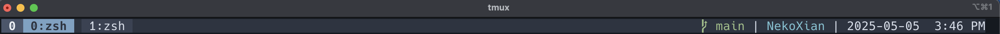

# NekoXian Tmux Configuration

This is a minimalistic tmux setup made from scratch inspired by Nord Colors with, more or less, everything that you need for everyday use.

---

## Screenshots



---

## Prerequisites

* `tmux`
* `TPM` **Very Crucial:** You should have this [installed](https://github.com/tmux-plugins/tpm). Follow the instructions there on how to install it.
* `git`
* `curl` (Highly recommended for easy installation)
* A [Nerd Font](https://www.nerdfonts.com/) set and installed in your terminal (Optional, but it recommended to have)

---

## Installation

I highly recommend using curl for the installation. Otherwise, you can choose the alternative ones.

### Curl Installation

1.  **Create Directories:** Create a scripts/ directory in your .tmux/ directory by pasting the command below in your terminal.
    ```bash
    mkdir -p ~/.tmux/scripts
    ```

2. **Download Config Files:** Copy the following command in your terminal to use curl to copy the .dotfiles (configurations files)to their respective directories.
    ```bash
    # Download .tmux.conf to your home directory
    curl -fLo ~/.tmux.conf [https://raw.githubusercontent.com/NekoXian/tmux/main/.tmux.conf](https://raw.githubusercontent.com/NekoXian/tmux/main/.tmux.conf)

    # Download the git branch script
    curl -fLo ~/.tmux/scripts/git_branch.sh [https://raw.githubusercontent.com/NekoXian/tmux/main/scripts/git_branch.sh](https://raw.githubusercontent.com/NekoXian/tmux/main/scripts/git_branch.sh)
    ```

3. **Make the script executable:** In order to show the branch name on the status bar, we need to make the github_script under scripts/ direcotry executable.
    ```bash
    chmod +x ~/.tmux/scripts/git_branch.sh
    ```

### Manual Cloning

Do this if you prefer cloning the repository. *Note: There is no symlinking involved.*

1.  **Clone the repository:**
    ```bash
    # Clone it anywhere you like
    git clone [https://github.com/NekoXian/tmux.git](https://github.com/NekoXian/tmux.git) ~/NekoXian-tmux
    cd ~/NekoXian-tmux
    ```

2.  **Create necessary directories:**
    ```bash
    mkdir -p ~/.tmux/scripts
    ```

3.  **Copy the configuration files (this will overwrite existing files):**
    ```bash
    echo "Copying .tmux.conf..."
    cp -fv .tmux.conf ~/.tmux.conf

    echo "Copying git_branch.sh..."
    cp -fv scripts/git_branch.sh ~/.tmux/scripts/git_branch.sh
    ```

4.  **Make the script executable:**
    ```bash
    chmod +x ~/.tmux/scripts/git_branch.sh
    ```

5.  **(Optional) Clean up the cloned directory:**
    ```bash
    cd ..
    rm -rf ~/my-tmux-setup
    ```
---

## Keybindings

* **Prefix:** `Ctrl+a`
* **Reload Config:** `Ctrl+a` then `r`
* **Install Plugins:** `Ctrl+a` then `I` (Shift+i)
* **Switching Windows:** Vim-like controls using HJKL.
* **Horizontal Split:** `prefix` + `/`
* **Vertical Split:** `prefix` + `-`

And many more!

---

## Plugins installed

Right of the box, there are plugins ready to be installed:

1. tmux-sensible
2. tmux-resurrect
3. tmux-continuum
4. tmux-yank
5. tmux-navigator
6. tmux-open
7. tmux-pain-control

You can comment these plugins if you don't want to use them.

---

## Reconfiguration

Reconfigure the configuration as you see fit. Rebind keybindings, install plugins you need, uninstall plugins that you don't need, this configuration is your oyster!
